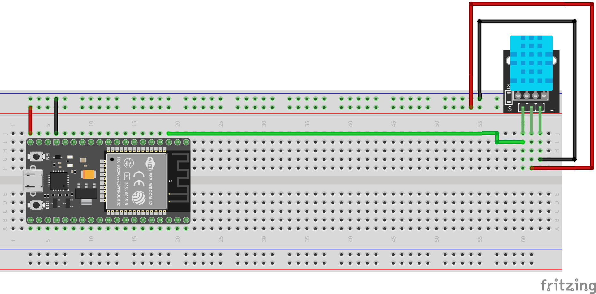

# ClimaCore
by BenjiG70

## Overview
This repo is build for a weatherstation powered by a WEMOS D1 Mini or ESP32. 
For web- and database server we use a Raspberry Pi. Here you can get 3D-Models of Serverracks for this. 


## Version logs
| Version | Description | Date|
|--------:|------------:|----:|
|1.0| basic functionality (webserver with charts and database connectivity); Arduino / ESP8266 tesscript | 2024.11.07|
|2.0 | completely reworked ui/ux, databasefunctions and backend | 2025.06.23|


## Getting started

### Install Nginx 

`sudo apt update`
`sudo apt install nginx`
start nginx server
`sudo systemctl start nginx`
autostart nginx server on boot
`sudo systemctl enable nginx`
check status
`sudo systemctl status nginx`

Output shall be: 
● nginx.service - A high performance web server and a reverse proxy server
     Loaded: loaded (/lib/systemd/system/nginx.service; enabled)
     Active: active (running)

To restart nginx:
`sudo systemctl restart nginx`

Test configurationfile
`sudo nginx -t`

if the firewall hit problems
`sudo ufw allow 2292`


### Setup Nginx Server

Nginx configuration File (nginx.conf)
```
user www-data;
worker_processes auto;
pid /run/nginx.pid;
error_log /var/log/nginx/error.log;
include /etc/nginx/modules-enabled/*.conf;

events {
    worker_connections 768;
    # multi_accept on;
}

http {
    include mime.types;

    server {
        listen 2292; #define port of webserver
        root /var/html/dist/web/browser;

        # Optionally, define an index file (like index.html)
        index index.html;

        # Add additional configuration, like handling 404 errors if necessary
        location / {
            try_files $uri $uri/ =404;
        }
    }
}
```

copy angular build file to nginx location
`cp -r [path_to_dist_folder] var/www/html/`


Install all needed librarys for the database
`sudo npm install sqlite3 cors express`

test database
`node path/to/your/database/folder/database.js`


### Setup automatic start of the DB server after boot
build a file for the database service
`sudo nano /etc/systemd/system/dbserver.service`

write your paths and user into the file
```
[Unit]
Description=Start Database Server via JavaScript
After=network.target

[Service]
ExecStart=path/to/your/node/installation path/to/your/database/folder/database.js
WorkingDirectory=/path/to/your/database/folder
Restart=always
User=your_user
Environment=NODE_ENV=production

[Install]
WantedBy=multi-user.target
```

enable dbserver.service
`sudo systemctl enable dbserver.service`
check if enabling is succeed
`systemctl is-enabled dbserver.service`
output shall be "enabled"
reboot raspy
`sudo reboot`
check status of db server
`sudo systemctl status dbserver.service`

## wiring the esp32
